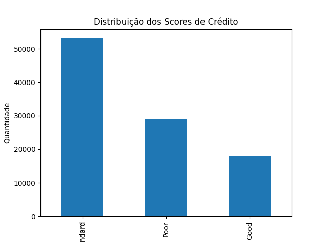
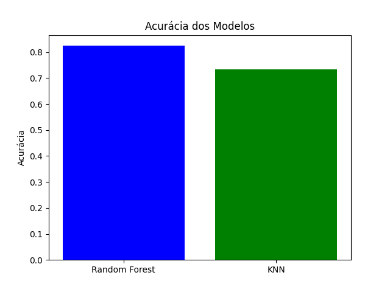
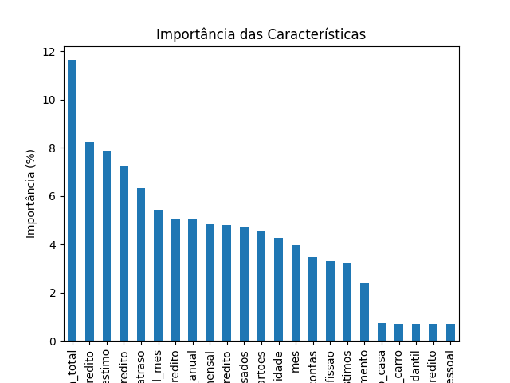

# Análise do Score de Crédito dos Clientes

Este projeto utiliza algoritmos de aprendizado de máquina para analisar dados de clientes de um banco e prever o score de crédito deles, categorizando-os em três classes: **Poor**, **Standard**, e **Good**. O objetivo principal foi identificar os padrões nos dados e treinar modelos para realizar previsões com boa acurácia.

## Resultados do Projeto

### 1. Distribuição dos Scores de Crédito

A análise da distribuição dos scores de crédito mostra que a maioria dos clientes se encontra na categoria **Standard**. O número de clientes com scores classificados como **Poor** é intermediário, enquanto a categoria **Good** é a menos frequente.

#### Observações:
- A maioria dos clientes apresenta um score mediano (**Standard**).
- Poucos clientes atendem aos critérios mais elevados de crédito (**Good**).

---

### 2. Acurácia dos Modelos

Dois modelos foram utilizados para prever os scores de crédito: **Random Forest** e **KNN (K-Nearest Neighbors)**. Os resultados mostram que o **Random Forest** obteve uma acurácia superior em comparação ao **KNN**.

#### Observações:
- **Random Forest** apresentou maior acurácia (~80%), sendo o modelo mais confiável.
- **KNN** apresentou uma acurácia menor (~70%), indicando que é menos adequado para este problema.

---

### 3. Importância das Características

O modelo **Random Forest** foi utilizado para calcular a importância relativa de cada variável nos resultados das previsões.

#### Observações:
- As características mais importantes para o modelo foram:
  1. **Total de Crédito**: Maior influência no score de crédito.
  2. **Limite de Crédito**: Indicador chave da capacidade financeira dos clientes.
  3. **Histórico de Atrasos**: Influência negativa no score de crédito.
- Características como **Renda Mensal** e **Idade** também apresentaram relevância significativa.
- Variáveis como **Dívida de Carro** e **Dívida Pessoal** tiveram pouca influência.

---

## Conclusão

Este estudo revelou que o **Random Forest** é o modelo mais adequado para prever scores de crédito neste conjunto de dados, devido à sua alta acurácia e capacidade de lidar com características diversas. As variáveis relacionadas ao crédito e histórico financeiro desempenham papéis cruciais na definição do score de crédito.

### Próximos Passos
1. **Otimização do Modelo:** Ajustar os hiperparâmetros do modelo Random Forest para aumentar ainda mais a acurácia.
2. **Análise Detalhada:** Explorar o impacto das características menos influentes.
3. **Implementação:** Desenvolver um sistema automatizado para prever scores de novos clientes.

---

## Imagens de Resultados
- [Distribuição dos Scores de Crédito](Figure_1.png)
- [Acurácia dos Modelos](Figure_2.png)
- [Importância das Características](Figure_3.png)
